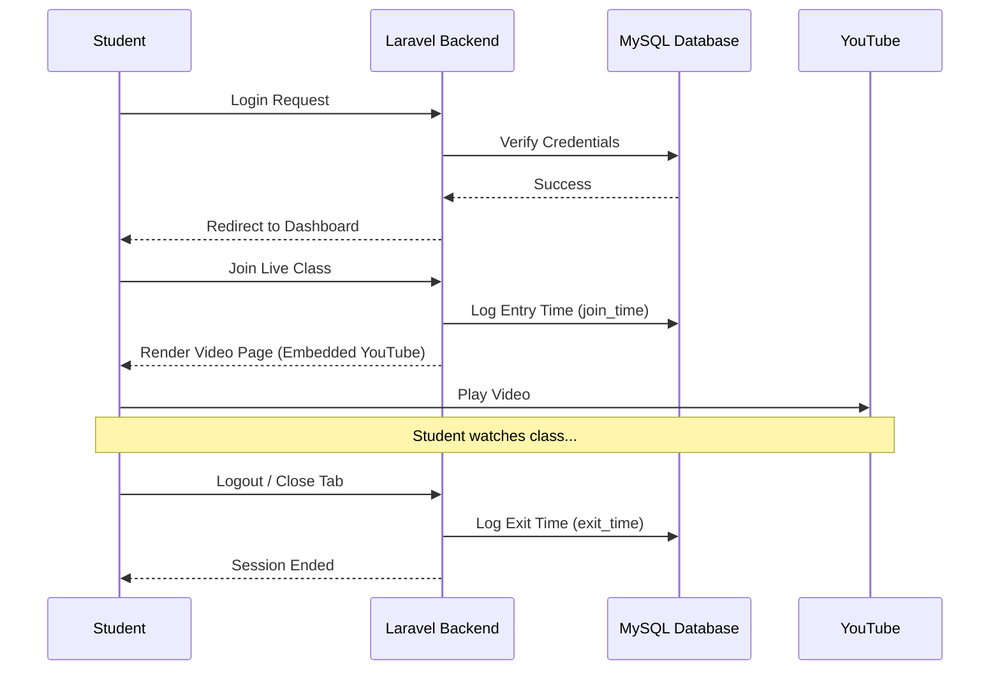

# User Flows

This document details the journeys for each user type within the Live Class Monitoring System.

## 1. Authentication Flow (Common)
1. User (Admin/College/Student) arrives at the landing/login page.
2. User enters credentials (Username/ID and Password).
3. System verifies credentials against the database.
4. On success, the system creates a session and redirects the user to their respective dashboard.

---

## 2. Super Admin Journey
1. **Login:** Access via `/admin`.
2. **Dashboard:** View system-wide metrics.
3. **Manage Colleges:**
   - Create a new College profile.
   - Configure College-specific settings.
4. **Monitoring:**
   - View list of all active students across all colleges.
5. **Reports:**
   - Select a college/date range to generate aggregated reports.

---

## 3. College Admin Journey
1. **Login:** Access via `/college`.
2. **Setup Students:**
   - Use "Bulk Upload" to import student data from Excel.
   - Credentials (Passwords) are either assigned in the file or auto-generated.
3. **Dashboard:** View student count and active class status.
4. **Manage Attendance:**
   - Access the "Reports" section to see who joined and left.
   - Download reports for institutional documentation.

---

## 4. Student Journey (Live Class)
1. **Login:** Access via `/login` or `/student`.
2. **Dashboard:** See "Live Class" button (active only when a class is live).
3. **Joining:**
   - Student clicks "Join Live Class".
   - **System Action:** System creates an `attendance_log` entry with the `join_time`.
4. **Watching:**
   - Student stays on the page with the embedded YouTube player.
5. **Exiting:**
   - Student clicks "Logout" OR closes the browser tab.
   - **System Action:** System detects session end/tab close and updates the `attendance_log` entry with the `exit_time`.

---

## 5. End-to-End Workflow Diagram

