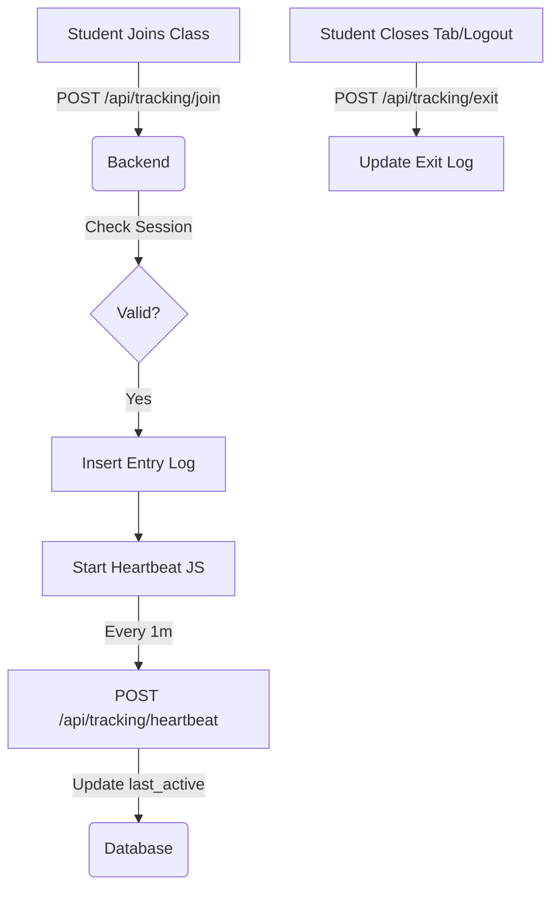

# System Architecture: Live Class Monitoring System

This document outlines the high-level architecture of the Live Class Monitoring System built on Laravel.

## Core Architecture
The application follows a **Monolithic Model-View-Controller (MVC)** architecture with internal API layers for real-time tracking.

### Tech Stack
- **Framework:** Laravel 11.x
- **Frontend:** Blade Templates + Tailwind CSS + Alpine.js (Livewire for interactive components).
- **Database:** MySQL 8.0+
- **Video Delivery:** YouTube IFrame Player API.

---

## Module Breakdown

### 1. Authentication Module
- **Guards:** Separate guards/scopes for `admin`, `college`, and `student`.
- **Drivers:** Session-based authentication (Laravel standard) for web panels.
- **Access Control:** Middleware-based authorization to restrict cross-panel access.

### 2. Management Services
- **College Service:** Handles institutional data and settings.
- **Student Service:** Manages student records and the Excel bulk-import pipeline.
- **Logging Service:** Handles the low-level SQL insertions for attendance events.

### 3. Tracking Module
- **Event Listener:** Captures `join` and `exit` triggers from the frontend.
- **Heartbeat System:** A background AJAX ping every 60 seconds to ensure the student is still active, acting as a fallback for the "exit" log.

---

## Data Flows

### 1. Request Lifecycle Overview
1.  **Request:** User hits a route (e.g., `/student/class`).
2.  **Middleware:** Verifies session, role, and active status.
3.  **Controller:** Service layer logic is invoked (e.g., check if a live session is active).
4.  **Response:** Rendered Blade view with embedded credentials.

### 2. YouTube Embed Integration Flow
1.  **Backend:** Super Admin sets the YouTube Video ID.
2.  **Frontend:** Student dashboard renders the YouTube IFrame using the **YouTube Player API**.
3.  **Security:** The backend signs a temporary token or session variable that the frontend must provide when logging attendance, preventing direct API hits from external tools.

### 3. Attendance Tracking Flow

---

## Folder Responsibilities
- `app/Services`: Business logic (e.g., Attendance logic).
- `app/Repositories`: Data access logic (keeping Eloquent calls out of services).
- `app/Http/Middleware`: Security and Role enforcement.
- `resources/views`: UI layout and components.
- `routes/web.php`: Primary navigation for all panels.
